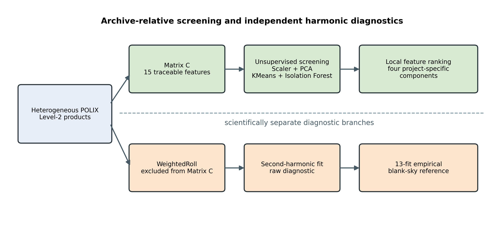
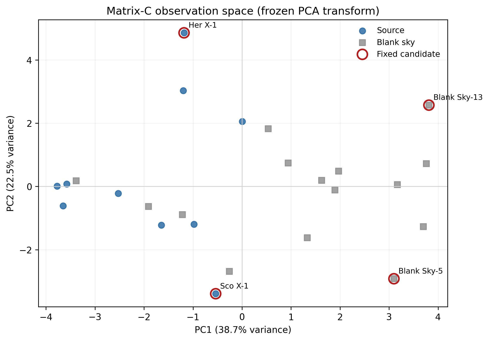
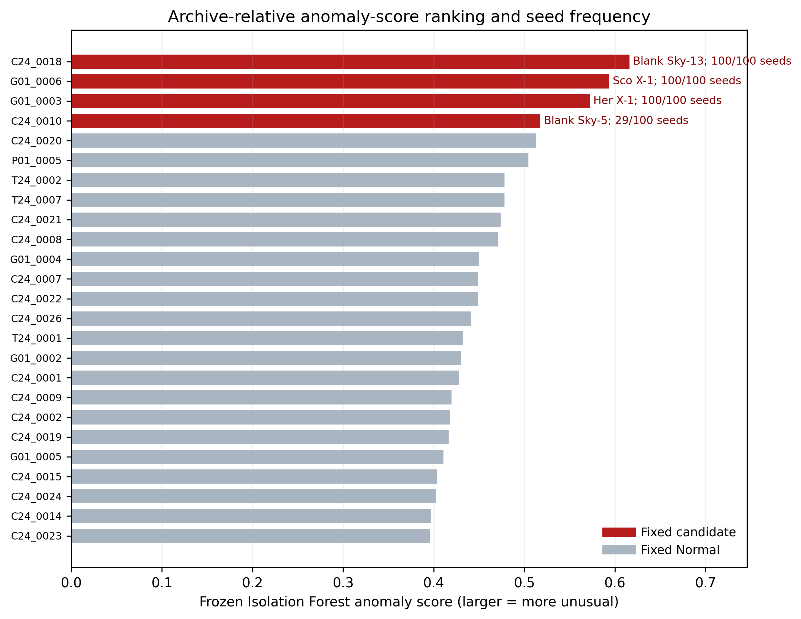
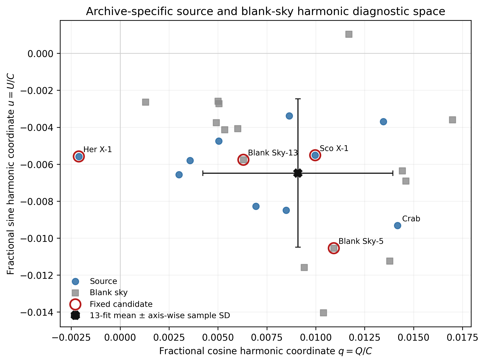

# An Explainable AI Framework for Analysis of X-Ray Polarimetry Data from XPoSat

**Author One**, **Author Two**, **Author Three**, and **Author Four**  
Department of [Department Name], [College/University], [City, Country]  
[corresponding-author email]

## Abstract

The Polarimeter Instrument in X-rays (POLIX) aboard XPoSat produces heterogeneous Level-2 products that require observation-level synthesis before archive screening. This work examines 25 POLIX observations included in a frozen project archive, comprising 10 project-labelled source observations and 15 project-labelled blank-sky observations. Exposure, channel-distribution, source-azimuth, delivered-light-curve, and cross-detector summaries are compressed into a traceable 15-feature Matrix-C representation. Standardization, principal component analysis, KMeans clustering, and Isolation Forest provide complementary views of this archive, with the fixed model artifact flagging four observations as anomaly candidates. A deterministic, project-specific local feature-ranking heuristic connects composite unusualness evidence to Matrix-C features and their product families. Seed, contamination, jackknife, feature-tier, and six-case neutralization analyses are treated as sensitivity or sanity checks rather than external validation. WeightedRoll is excluded from Matrix C and analysed independently through a weighted second-harmonic fit and an empirical reference formed from 13 qualifying blank-sky fits. Representative observations show that Matrix-C unusualness and modulation-like harmonic behaviour do not identify the same property within the project archive. The Flask interface exposes the saved workflow as a researcher-facing inspection prototype. The study is limited by the small unlabeled sample, archive-specific fitting, proxy feature semantics, source-plus-background WeightedRoll products, and absence of official background, polarization-degree, and sky-angle calibration.

**Index Terms—** XPoSat, POLIX, X-ray polarimetry, unsupervised anomaly detection, explainable artificial intelligence, scientific machine learning.

## I. Introduction

X-ray polarimetry provides information complementary to timing, imaging, and spectroscopy by measuring the orientation dependence of detected radiation. XPoSat is an Indian Space Research Organisation (ISRO) mission carrying the Polarimeter Instrument in X-rays (POLIX) and the X-ray Spectroscopy and Timing instrument [@isro_xposat]. POLIX is a Thomson-scattering polarimeter, and its Level-2 release contains several observation products with different computational and physical meanings [@rishin2010thomson; @fabiani2018instrumentation; @polix_handbook_2025]. A researcher comparing observations must therefore reason across exposure, channel-distribution, source-azimuth, delivered-light-curve, detector, and roll-modulation products rather than analyse one homogeneous table.

This study treats this as an applied scientific-computing problem. It summarizes selected Level-2 products at observation level, screens the resulting vectors without trusted anomaly labels, ranks local feature evidence, and exposes the saved workflow through a Flask interface. Because trusted anomaly labels were unavailable, the final pipeline used a project-specific unsupervised explanation method rather than supervised or general post-hoc explainers.

The physical interpretation was deliberately separated from the statistical screening. WeightedRoll contains exposure-weighted source and background modulation contributions and is not assumed to be an officially background-corrected source product [@polix_handbook_2025]. It is therefore excluded from the deployed feature matrix and fitted only in an independent harmonic branch. This design prevents the same modulation information from generating an anomaly flag and then being used as circular confirmation.

Prior astronomical studies show the value of unsupervised ranking and human inspection in label-poor archives [@baron2017weirdest; @giles2019serendipity; @lochner2021astronomaly]. Explainable-anomaly work likewise emphasizes that an explanation of unusualness is not the same as an explanation of a supervised label [@li2024explainable_anomaly]. Limited published work was identified that directly combines product-provenance-aware POLIX observation summaries, unsupervised screening of the project archive, local model-informed evidence ranking, and a separate blank-sky-referenced harmonic diagnostic. This is a scoped literature finding, not a priority or superiority claim.

The central question is: *Can heterogeneous POLIX Level-2 products be represented through interpretable, product-aware features and screened using explainable unsupervised learning, while maintaining an independent comparison with blank-sky-referenced harmonic modulation behaviour?*

The primary contribution is a traceable, product-aware Explainable Artificial Intelligence (XAI) framework for screening heterogeneous POLIX Level-2 observations within the project archive. Three secondary contributions support it:

1. a 15-feature observation representation that preserves provenance to POLIX product families;
2. a deterministic, project-specific, model-informed local feature-ranking method that connects composite unusualness evidence to original feature families; and
3. a scientifically separate WeightedRoll and empirical blank-sky harmonic branch for comparing statistical and modulation-like evidence without circular confirmation.

The seed, contamination, jackknife, feature-tier, and feature-neutralization analyses provide sensitivity or sanity-check evidence. The Flask interface is a reproducibility and inspection implementation. Neither is presented as an additional major research contribution.

## II. Literature Review and Related Work

### A. XPoSat, POLIX, and Polarimetric Analysis

Official mission, archive, and handbook sources establish the mission scope, released data organization, and product-use boundaries [@isro_xposat; @issdc_xposat_archive; @polix_handbook_2025]. POLIX measures azimuthal scattering behaviour associated with Thomson scattering [@rishin2010thomson]. Reviews of X-ray polarimetry describe how instrumental modulation, background, response calibration, and coordinate conventions enter physical polarization inference [@fabiani2018instrumentation].

Linear cosine and sine coefficients provide a convenient second-harmonic representation. Stokes-based treatments formalize related quantities and their statistics [@kislat2015stokes]. In this paper, however, the fitted coefficients are called *harmonic coefficients* or *fractional harmonic coordinates*. They are not treated as calibrated sky Stokes parameters because the project does not implement an official POLIX background procedure, an official modulation factor, or a verified detector-to-sky angle conversion.

### B. Unsupervised Screening in Astronomy

Principal component analysis (PCA), KMeans, and Isolation Forest provide complementary geometric, clustering, and isolation views [@pearson1901pca; @macqueen1967kmeans; @liu2008isolation]. The saved implementation uses their scikit-learn realizations [@pedregosa2011sklearn]. Astronomical anomaly-ranking studies demonstrate how unsupervised methods can prioritize unusual spectra or objects for inspection [@baron2017weirdest; @giles2019serendipity], while Astronomaly incorporates human feedback into anomaly discovery [@lochner2021astronomaly]. These studies motivate researcher triage, but they do not provide ground truth for the 25 POLIX observations used here.

### C. Explainable Anomaly Detection

General post-hoc explanation methods such as SHAP allocate prediction differences under defined background and coalition assumptions [@lundberg2017shap]. The deployed project method is not SHAP and has no Shapley guarantee. It combines quantities extracted from the fitted PCA, KMeans, and Isolation Forest components with standardized feature abnormality. Explainable-anomaly literature supports separating the object being explained, the reference, and the explanatory guarantee [@li2024explainable_anomaly].

Behavioural evaluation can test whether features judged influential actually change model evidence when perturbed [@yeh2019infidelity]. Evaluation without anomaly labels remains difficult, and algorithm comparisons can be unstable across datasets and metrics [@campos2016evaluation]. Accordingly, the six-case neutralization experiment is interpreted only as an in-sample sanity check of this fitted workflow.

### D. Research Gap

The reviewed sources address POLIX instrumentation and data meaning, general polarimetric analysis, unsupervised astronomical ranking, or explainable anomaly detection separately. They do not provide a directly comparable end-to-end framework for the specific product combination and evidence separation studied here. This work investigates that integration for the project archive; it does not claim a generally validated POLIX anomaly detector.

## III. Dataset, Scope, and Problem Formulation

The project archive contains 25 identifier-matched POLIX Level-2 observations: 10 mapped by the project as source observations and 15 mapped as blank sky. The source targets include three Crab observations and one observation each for Sco X-1, Her X-1, GX 301-2, Cyg X-1, 4U 1700-37, Cen X-3, and Cassiopeia A. Observation identifiers, rather than display labels, are the controlling keys. The scope is “25 POLIX Level-2 observations included in the project archive,” not all released or publicly available POLIX data.

**Table I. Dataset composition and product roles**

| Project role | Count | Role in the study |
|---|---:|---|
| Source | 10 | Matrix-C screening and independent harmonic comparison |
| Blank sky | 15 | Matrix-C screening; 13 qualifying fits form the empirical harmonic reference |
| Total | 25 | All observations processed in the saved project outputs |

The available products are grouped into roll-exposure and channel-distribution summaries, source-azimuth summaries, delivered light curves, cross-detector diagnostics, and WeightedRoll. These families do not share units or dimensionality, so the computational unit is an observation-level feature vector. No trusted anomaly labels or official anomaly ground truth are available. The model therefore asks which observations appear statistically unusual within the project archive under the saved representation and decision rule.

This question is distinct from calibrated polarimetry. A candidate flag does not imply polarization-like behaviour, and a fitted modulation does not confirm an anomaly. The handbook also places release-specific limits on physical inference from the available products [@polix_handbook_2025]. Reported physical quantities are consequently diagnostic summaries only.

## IV. Product-Aware Feature Engineering

The project developed three nested feature tiers. Matrix A contains eight exposure and channel-distribution features. Matrix B adds three source-azimuth features. Matrix C adds four delivered-light-curve and cross-detector features, producing the final 15-feature deployed representation. A separate WR matrix summarizes WeightedRoll diagnostics but is not an input to the Matrix-C model.

**Table II. Final Matrix-C feature groups**

| Product family | Matrix-C features | Safe interpretation |
|---|---|---|
| Roll exposure | `t1A_exp_uniformity_cv`; `t1A_exp_max_to_min_roll` | Relative exposure nonuniformity across roll bins |
| Channel distribution | `t1A_energy_peak_channel`; `t1A_energy_weighted_mean_channel`; `t1A_energy_weighted_std_channel`; `t1A_energy_high_channel_fraction`; `t1A_energy_channel_entropy`; `t1A_energy_anode_balance_cv` | Channel-space distribution and anode-balance summaries, not calibrated energy or spectroscopy |
| Source azimuth | `t1B_src_peak_to_median_roll`; `t1B_src_roll_entropy`; `t1B_src_roll_smoothness_norm` | Roll-distribution summaries; the last is an order-dependent roughness proxy |
| Delivered light curve | `t2_lc_rate_cv`; `t2_lc_peak_to_median_rate` | Diagnostic variation in delivered RATE arrays, not intrinsic source variability |
| Cross-detector | `t2_det_lc_rate_balance_cv`; `t2_det_pha_centroid_spread` | Detector-balance and channel-centroid diagnostics |

The “high-channel fraction” uses a channel-index threshold; it is not an energy-calibrated quantity. The source-roll roughness quantity is a normalized mean absolute first difference over stored order and does not include a circular closing difference. Light-curve statistics summarize the delivered arrays and do not establish intrinsic variability or a physical cause.

The saved Matrix-C file has 25 rows, 15 features, and zero missing values. No imputer appears in the saved pipeline or deployed extraction path. The paper therefore makes no median-imputation claim. Matrix C was the completed project’s deployed choice, not a demonstrated universal optimum. Existing A/B/C comparisons are used to expose feature-tier sensitivity.

## V. Explainable Unsupervised Methodology

### A. Saved Screening Pipeline

For an observation vector \(\mathbf{x}_i\), the saved `StandardScaler` produces \(\mathbf{z}_i\). PCA projects standardized observations into two components for geometric inspection. KMeans with \(k=5\), `n_init=20`, and random state 42 describes assigned local structure. Isolation Forest uses 100 trees, contamination 0.16, and random state 42. Its saved `predict` result alone defines the fixed Normal/candidate label. The anomaly score is a ranking quantity, not a probability, and contamination is an imposed screening assumption rather than an estimate of true anomaly prevalence.

PCA, KMeans, and Isolation Forest are complementary components, not three independent validators. In particular, two fitted KMeans clusters are singletons; Sco X-1 and Blank Sky-13 consequently have zero distance from their assigned centroids. Zero assigned-centroid distance in this setting does not imply that either observation is ordinary.

### B. Project-Specific Local Feature Ranking

The explanation reports within-observation feature ranks from four components:

\[
p_{ij}=\sum_{r=1}^{2}|z_{ij}w_{rj}|\lambda_r ,
\]

\[
k_{ij}=(z_{ij}-c_{g(i)j})^2 ,
\]

\[
o_{ij}=s(\mathbf{z}_i)-s(\mathbf{z}_i^{(j\leftarrow0)}), \qquad
a_{ij}=|z_{ij}|.
\]

Here \(w_{rj}\) and \(\lambda_r\) are the PCA loading and explained-variance ratio, \(c_{g(i)j}\) is the assigned KMeans centroid component, and \(s\) is the Isolation Forest score used by the service. Each feature-wise component is normalized by its maximum absolute value within the observation; only positive occlusion deltas enter the combination:

\[
e_{ij}=N(p_{ij})+N(k_{ij})+N(\max(o_{ij},0))+N(a_{ij}).
\]

Thus \(e_{ij}\) measures composite, model-informed local evidence under four project choices. It does not decompose the binary Isolation Forest label, provide causal attribution, or support comparison of absolute feature-importance magnitudes between observations. The system maps leading features back to product families and constructs a deterministic sentence from templates. No large language model generates that sentence.

### C. Feature-Neutralization Sanity Check

The exploratory explanation analysis contains six cases and is distinct from the fixed four-candidate output. For each case, high-ranked standardized features are set to zero and PCA distance and Isolation Forest score are recomputed. Under the study’s verdict rule, reductions in both quantities are Strong and a partial response is Moderate. The saved reproduction gives five Strong, one Moderate, and zero Weak verdicts. KMeans is not part of this verdict. The exercise demonstrates behavioural consistency for six in-sample cases under one neutralization baseline; it does not establish statistical significance, causal faithfulness, or external validity.

## VI. Independent Harmonic Diagnostic

WeightedRoll is exposure-weighted and includes source and background modulation contributions [@polix_handbook_2025]. For roll-bin centre \(\phi\), the Notebook-11 analysis fits

\[
y(\phi)=C+Q\cos(2\phi)+U\sin(2\phi)
\]

by inverse-variance weighted linear least squares. The fractional harmonic coordinates are \(q=Q/C\) and \(u=U/C\). The raw modulation and fitted modulation phase are

\[
m_{\mathrm{raw}}=\frac{\sqrt{Q^2+U^2}}{C},
\qquad
\psi_{\mathrm{fit}}=\frac{1}{2}\operatorname{atan2}(U,Q).
\]

The symbols \(Q\) and \(U\) denote fitted coefficients in this model, not calibrated sky Stokes parameters. Raw modulation is not polarization degree (PD), and fitted phase is not official sky polarization angle (PA).

The project classifies fits with reduced chi-square \(\chi_\nu^2\le2\) as acceptable, \(2<\chi_\nu^2\le5\) as caution, and larger values as poor. These study-specific screening bands are not p-values or detection thresholds. Of 15 blank-sky observations, 13 meet the acceptable rule. Their fractional coordinates define an empirical archive reference with \(\bar q=0.0090920\), \(\bar u=-0.0064782\), sample standard deviations 0.0048569 and 0.0040190, respectively. A diagonal standardized distance is descriptive: it ignores \(q/u\) covariance, individual fit uncertainty, baseline-estimation uncertainty, and observing-condition matching.

The manuscript reports central values and fit-quality categories from the saved Notebook-11 CSVs. The later Flask service uses a different propagation for raw-modulation uncertainty \(A/C\); the two implementations are not combined. The detailed comparison belongs in supplementary material. No official background subtraction, official \(\mu_{100}\), calibrated PD, or verified PA conversion is claimed.

## VII. Results

### A. Fixed Deployed Result

The saved Matrix-C artifact reproduces 21 Normal outputs and four anomaly candidates: C24_0018 (Blank Sky-13), G01_0006 (Sco X-1), G01_0003 (Her X-1), and C24_0010 (Blank Sky-5). These labels mean statistically unusual within the project archive and require domain-expert inspection.

### B. Procedure-Qualified Stability

In the existing 100-seed Isolation Forest experiment, Blank Sky-13, Sco X-1, and Her X-1 were selected in 100/100 runs. Blank Sky-5 was selected in 29/100. Blank Sky-15, which is Normal under the fixed model, appeared in 68/100. The defensible summary is therefore a “three-candidate Matrix-C core stable under the tested procedures,” together with a seed-sensitive threshold neighbourhood. It is not a general robust-anomaly claim.

Contamination sensitivity varies thresholds over one fixed Isolation Forest ordering and is not independent validation. The saved jackknife is a retrospective influence analysis, not held-out generalization; Sco X-1 was not selected by its held-out refit. These qualifications prevent the sensitivity analyses from being overinterpreted.

### C. Cross-Feature-Tier Persistence

Across Matrix A, B, and C fixed-seed candidate sets, Sco X-1 and Blank Sky-13 persist. Her X-1 appears only in Matrix C, while Blank Sky-5 appears in B and C. This cross-tier result is separate from both the fixed four and the three-case seed-stable core. It shows representation dependence and does not establish that Matrix C is superior. WR results remain a separate diagnostic and are not counted as cross-tier confirmation.

### D. Local Feature-Ranking Examples

**Table III. Fixed candidates, stability, feature-tier persistence, and leading local evidence**

| Observation | Fixed score | Seed frequency | A/B/C presence | Leading local evidence in the saved implementation |
|---|---:|---:|---|---|
| Blank Sky-13 (C24_0018) | 0.615964 | 100/100 | A, B, C | Weighted channel spread (`t1A_energy_weighted_std_channel`) |
| Sco X-1 (G01_0006) | 0.593516 | 100/100 | A, B, C | Peak channel 2.454; weighted mean channel 2.207; channel entropy 1.814 |
| Her X-1 (G01_0003) | 0.572308 | 100/100 | C | Delivered-light-curve rate coefficient of variation |
| Blank Sky-5 (C24_0010) | 0.517611 | 29/100 | B, C | Source-roll order-dependent roughness proxy |

For Sco X-1, the current versioned function ranks energy peak channel first, weighted mean channel second, and channel entropy third. A historical entropy-first narrative could not be reproduced from any located versioned artifact and is superseded for manuscript use. These ranks indicate which channel-distribution summaries dominate this observation’s composite local score; they do not identify an astrophysical cause or a calibrated spectral property.

### E. Harmonic and Blank-Sky Results

All 25 WeightedRoll products have saved harmonic-fit outputs. Nineteen are acceptable, three caution, and three poor under the study’s rule. The 13 qualifying blank-sky fits have mean raw modulation 1.147820% and sample standard deviation 0.565960%. All ten source raw-modulation values fall within the declared empirical mean \(\pm2\) sample-standard-deviation scalar range. This range is descriptive and is not a polarization-detection criterion.

**Table IV. Representative harmonic and blank-sky-relative results**

| Observation | Raw modulation (%) | Fit category; reduced \(\chi^2\) | Fractional-coordinate distance | Bounded interpretation |
|---|---:|---|---:|---|
| Sco X-1 (G01_0006) | 1.1396 | Caution; 2.0308 | 0.3005 | Matrix-C candidate; harmonic coordinates within the declared empirical blank-sky reference rule |
| Her X-1 (G01_0003) | 0.5966 | Poor; 57.4335 | 2.3174 | Matrix-C candidate; physical interpretation limited by poor simple-harmonic fit |
| Crab (P01_0005) | 1.6973 | Acceptable; 1.0625 | 1.2649 | Not a fixed Matrix-C candidate; measurable raw harmonic summary within the declared scalar range |
| Blank Sky-13 (C24_0018) | 0.8540 | Caution; 2.5658 | — | Strong ML screening evidence does not imply an acceptable harmonic fit |
| Blank Sky-5 (C24_0010) | 1.5185 | Acceptable; 0.7134 | — | Seed-sensitive ML flag can coexist with an acceptable harmonic fit |

The table omits uncertainty values because they are unnecessary to the central comparison and the notebook/service propagation differs. Full central values, fit classes, and provenance remain available in the supplementary plan.

## VIII. Discussion

The main empirical finding is that statistical unusualness and modulation-like harmonic evidence are non-equivalent within the project archive. “Non-equivalent” means the branches do not measure or select the same property. Matrix C summarizes exposure, channel-distribution, source-azimuth, delivered-light-curve, and detector balance. The physical branch instead summarizes a source-plus-background roll-modulation product relative to an empirical blank-sky sample.

Sco X-1 is a fixed candidate and part of the three-case seed-stable core. Its local ranking is dominated by channel-distribution proxies, while its fractional harmonic coordinates lie near the empirical blank-sky centre. The result supports inspection of its Level-2 channel products; it does not support a polarization claim or a spectral cause.

Her X-1 is also seed-stable in Matrix C but not persistent across A and B. Its leading local evidence comes from a delivered-light-curve diagnostic proxy. Its simple harmonic fit is poor, so the larger descriptive coordinate distance should not be treated as strong physical evidence. The combination instead illustrates why fit quality must constrain interpretation.

Crab P01_0005 is not one of the fixed Matrix-C candidates, although its raw modulation is among the larger source values and its simple harmonic fit is acceptable. The source value remains within the declared empirical blank-sky scalar range. This is another discordant case: visible harmonic structure does not automatically imply multivariate Matrix-C unusualness or calibrated polarization.

The two blank-sky candidates reinforce the same distinction. Blank Sky-13 has strong screening stability but only a caution harmonic fit. Blank Sky-5 has an acceptable harmonic fit but is seed-sensitive in the Isolation Forest analysis. No instrumental or environmental cause is assigned. Observation conditions, background variability, product semantics, and calibration require POLIX-aware review.

The framework’s practical value is traceability. A researcher can move from a project-archive flag to named product-family summaries, inspect the component evidence, and separately check raw harmonic behaviour. This is a triage workflow, not an automated scientific decision system.

## IX. Limitations and Threats to Validity

The study has several linked limitations.

1. **Small, unlabeled archive.** With \(n=25\) and no anomaly ground truth, candidate counts and sensitivity results are descriptive. No accuracy, recall, false-positive rate, or future-observation performance can be estimated.
2. **Retrospective same-archive analysis.** Scaling, PCA, KMeans, and Isolation Forest were fitted on the same archive being described. The jackknife is an influence check, not deployment validation.
3. **Threshold and feature dependence.** Contamination 0.16 imposes the fixed four-candidate rule. Membership near the boundary is seed- and feature-tier-sensitive. KMeans includes singleton clusters.
4. **Proxy semantics.** Channel indices are not calibrated energies; the high-channel fraction is not a high-energy measurement; source-roll roughness depends on stored order; delivered-light-curve features do not establish intrinsic variability.
5. **Project-specific explanation.** The four-component score is a within-observation heuristic. Its six-case, in-sample neutralization check uses a single zero baseline and study-specific sign-only verdicts.
6. **Physical-diagnostic boundary.** WeightedRoll contains source and background contributions. The 13-fit reference is selected by the study’s fit-quality rule and is not official background subtraction. The diagonal coordinate distance is not a confidence region.
7. **Calibration boundary.** The study has no official background procedure, official \(\mu_{100}\), calibrated PD, or verified sky-PA conversion.
8. **Implementation provenance.** The saved Notebook-11 CSVs and later Flask service propagate raw-modulation uncertainty differently. The saved model was loaded during audit under a scikit-learn version different from the artifact’s recorded version, and the original environment was not fully pinned.
9. **Domain review and deployment.** Feature semantics and representative physical interpretation need POLIX-aware review. The Flask application is a proof-of-concept research interface without future-release drift validation.

These limitations restrict the result to screening within the project archive and diagnostic comparison. Additional releases, official calibration, matched background guidance, and prospective validation are future work and were not executed in this workflow.

## X. Conclusion

This work implemented a traceable framework that compresses heterogeneous POLIX Level-2 products into a 15-feature observation representation, applies a saved unsupervised screening stack, ranks local composite feature evidence, and keeps WeightedRoll harmonic analysis scientifically separate. In the 25 observations included in the project archive, the saved model produced 21 Normal outputs and four anomaly candidates. Three candidates were stable across the tested Isolation Forest seeds, while Blank Sky-5 was seed-sensitive.

Representative cases showed that Matrix-C statistical unusualness and modulation-like harmonic behaviour do not identify the same property within this archive. The result supports researcher triage and product-level inspection; it does not establish astrophysical anomalies, polarization, calibrated PD, or official sky polarization angle. Future use should incorporate new POLIX releases, official background and calibration information, a pinned environment, and prospective expert-reviewed validation.

## Acknowledgment

The acknowledgment wording follows the current ISSDC guidance [@issdc_xposat_ack].

This publication uses the data from the XPoSat mission of the Indian Space Research Organisation (ISRO), archived at the Indian Space Science Data Centre (ISSDC).

## References

The controlled BibTeX library is `03_FINAL_REFERENCES.bib`. Every retained entry is mapped to a manuscript claim in `05_FINAL_REFERENCE_CLAIM_MAP.md`.
